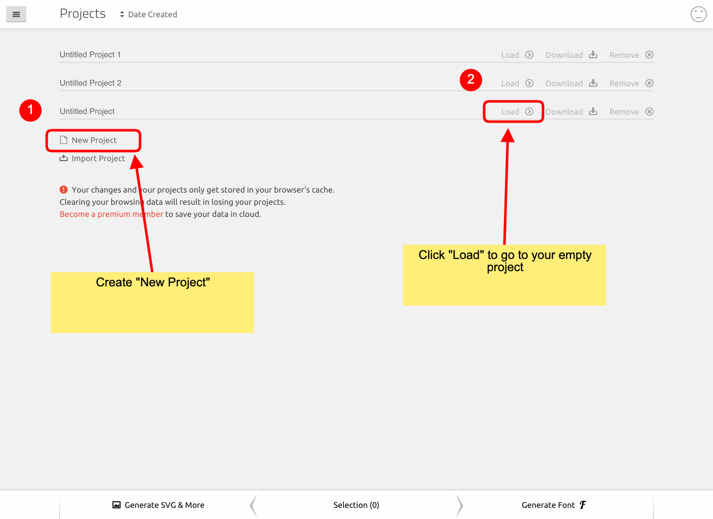
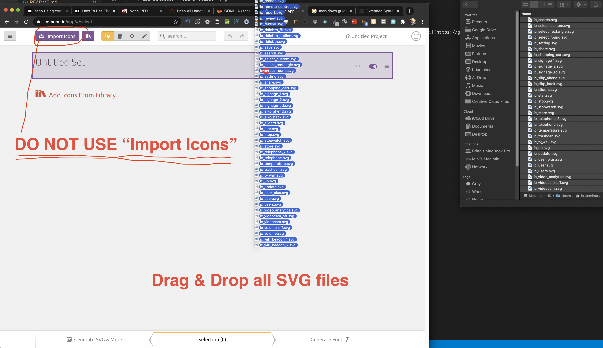
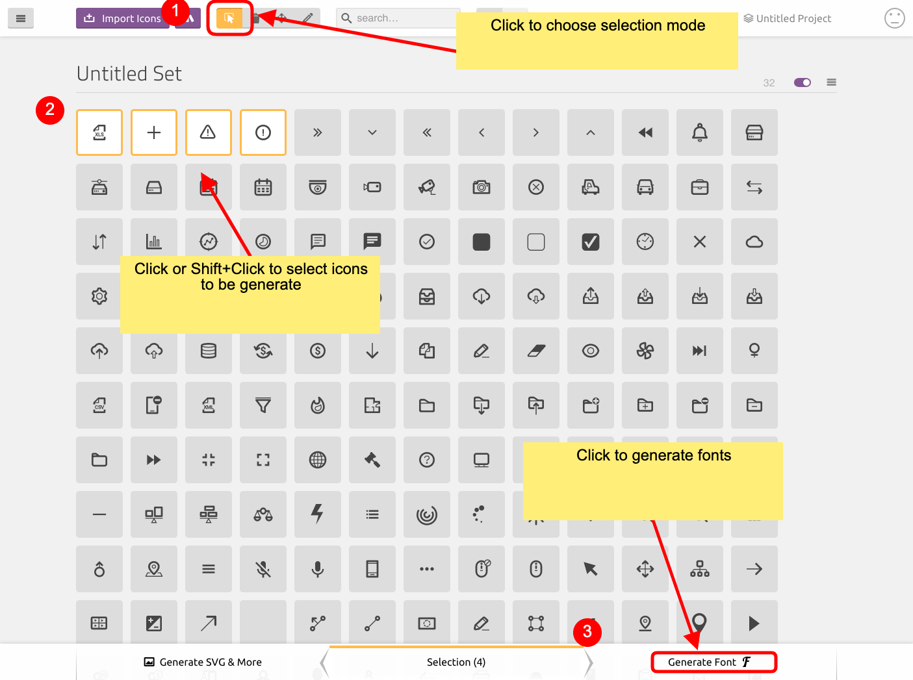
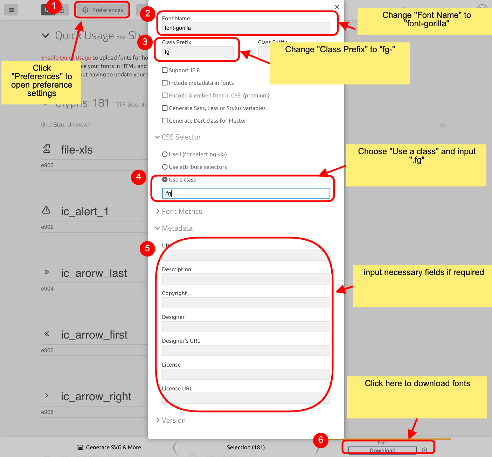

# Introduction
*font-gorilla* is a collection of commonly used icons
 *  [Demo Icons](http://gui.gorilla-technology.com/font-gorilla/example/demo.html)

## Prerequisites
1. Latest version of npm ~ 3.8.0: `npm install -g npm` (check `npm -v`)  
2. node version >= 6.0.0 (check `node -v`)  
  
## Installation
`npm install git+ssh://git@git.gorilla-technology.com:scrd01/font-gorilla.git`

## Include css
In entry app.js:
```
import 'font-gorilla/css/font-gorilla.css'
```

## Usage
For rendering icon inside js: `<i className='fg fg-close'/>`  
Icons in `font-gorilla/dist/muiSvgIcons/*` are wrapped using `@material-ui/core/SvgIcon` see below for example:
```
import FilterIcon from 'font-gorilla/dist/muiSvgIcons/ic_filter';

const JustIcon = () => {
    return (
      <FilterIcon />
    );
};
```
Files in `font-gorilla/dist/dim/*` will return dimension of the SVG in pure-javascript, you can use it to wrap in your framework's SVG wrapper.

# Process for building new icon set
1. Replace font-gorilla/svg folder content with your new svg folder content (a folder consisting of latest icons)
2. Go to [icomoon font generator](https://icomoon.io/app/), create a new empty set and drag all svg icons into this set
3. Select all icons in this new set, click on 'Generate Font'
4. Before downloading font, edit setting to use following:
    * Font Name: `font-gorlla`
    * Class Prefix: `fg-`
    * CSS Selector - Use a class: `.fg`
5. Click on Download
6. Copy all content of downloaded folder into font-gorilla/icomoon
7. `npm run build-icomoon`
8. Commit
9. Go modify react-ui/less/checkbox.less line:35 with new checkout-outline icon's UTF-8 character code in [react-ui](https://git.gorilla-technology.com/gorilla/react-ui)

# icomoon tutorial



